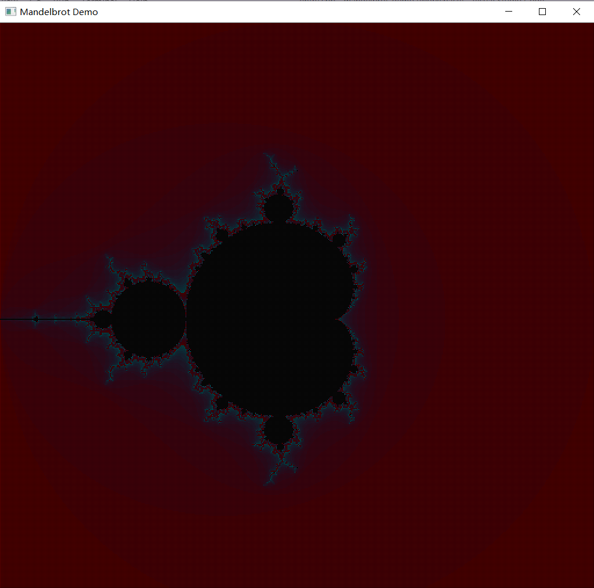

Test only passed on win10 x64.

# Hot Key

`WASD` : move

`up` : zoom in

`down` : zoom out

# args

~~`./mandelbrot_demo x y ratio` (not implemented yet)~~

or

`./mandelbrot_demo` 

> in this case, x=0,y=0,ratio=2.0

# Build
`make all`